# Design Document: Devotional Manager

## Overview

The Devotional Manager is a mobile-first web application built on top of the existing Laravel 13 + React 19 + Inertia.js v2 starter kit. It provides two primary modes of engagement:

1. **Thematic Devotions** — structured devotional content organized by topics (faith, forgiveness, poverty, shame, etc.) with scripture references, reflection prompts, and optional Seventh-day Adventist insights.
2. **Bible Study** — systematic Bible reading plans, word studies, and Greek/Hebrew origin exploration.

Devotional content (Themes and Devotional Entries) is created and published exclusively by admin users. Regular users consume this shared, global content — they can browse, read, complete, bookmark, and add observations, but cannot create, edit, or delete themes or devotional entries. Admins can create content manually or use AI-assisted generation via the Laravel AI SDK (Prism), where the admin provides a prompt and the AI generates structured devotional content (title, body, scripture references, reflection prompts, Adventist insights) for review and publishing. Content follows a draft/published workflow — only published content is visible to regular users.

The app supports many independent users, each with their own bookmarks, progress, and observations. A user can optionally link with one partner (e.g., a spouse or study companion) to enable collaborative features like shared observations, partner notifications, and "completed together" tracking. Users without a linked partner can use the app fully in solo mode — partner features are gracefully hidden when no partner is linked. Authentication is handled via social login providers (Google, Apple, GitHub) using Laravel Socialite, or via passwordless email OTP (one-time password) login — no traditional email/password registration. The app is installable as a PWA with offline support for previously viewed content.

### Key Design Decisions

- **Admin-only content creation**: Devotional content (Themes and Devotional Entries) is created exclusively by admin users. Regular users are consumers only — they browse, read, complete, bookmark, and add observations. An `is_admin` boolean on the `users` table controls access. Admins access a dedicated admin panel for content management.
- **AI-assisted content generation via Laravel AI SDK (Prism)**: Admins can generate devotional content by providing a prompt to an AI agent. Prism generates structured content (title, body, scripture references, reflection prompts, Adventist insights) which the admin can review, edit, and publish. An `AiGenerationLog` model tracks all generation requests and results for auditing.
- **Draft/published content workflow**: Themes and Devotional Entries have a `status` field (`draft` or `published`). Admins can save content as drafts and publish when ready. Only published content is visible to regular users.
- **Bible API vs. local data**: Scripture text will be fetched from a free Bible API (e.g., API.Bible or bible-api.com) and cached in the database. This avoids bundling entire Bible translations while enabling offline access for viewed passages.
- **Partner linking (optional)**: A simple `partner_id` foreign key on the `users` table links two users as devotional partners. This is entirely optional — a user can use the app solo without ever linking a partner. When no partner is linked, collaborative features (shared observations, partner notifications, "completed together" indicators) are hidden.
- **Social login via Laravel Socialite**: Authentication uses OAuth providers (Google, Apple, GitHub) instead of traditional email/password. A `social_accounts` table stores provider credentials linked to users, allowing multiple social accounts per user.
- **Passwordless email OTP login**: Users can also authenticate via a 6-digit one-time password sent to their email. The OTP is hashed (using `Hash::make()`) before storage in an `email_otps` table with a 10-minute expiry. After 3 failed verification attempts the OTP is invalidated. Rate limiting (5 OTP requests per email per hour) prevents abuse. OTPs are sent via Laravel Mail using a Mailable class.
- **PWA via Vite plugin**: Use `vite-plugin-pwa` with Workbox for service worker generation, caching strategies, and offline support.
- **AI images via OpenAI DALL-E**: Server-side API calls to generate images, stored in Laravel's filesystem (local disk or S3).
- **Word study data**: Seeded from a Strong's Concordance dataset, stored locally in the database for fast lookups.

## Architecture

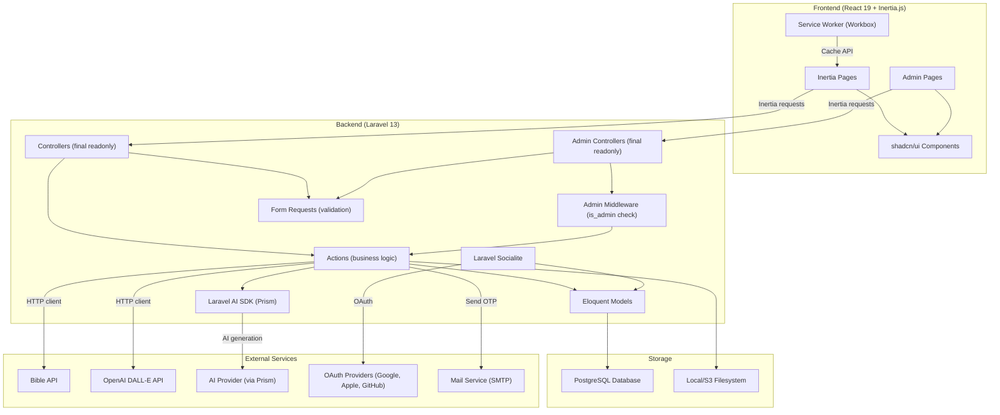
```mermaid
graph TB
    subgraph Frontend["Frontend (React 19 + Inertia.js)"]
        Pages["Inertia Pages"]
        AdminPages["Admin Pages"]
        Components["shadcn/ui Components"]
        SW["Service Worker (Workbox)"]
        Pages --> Components
        AdminPages --> Components
    end

    subgraph Backend["Backend (Laravel 13)"]
        Controllers["Controllers (final readonly)"]
        AdminControllers["Admin Controllers (final readonly)"]
        AdminMiddleware["Admin Middleware (is_admin check)"]
        Actions["Actions (business logic)"]
        FormRequests["Form Requests (validation)"]
        Models["Eloquent Models"]
        Socialite["Laravel Socialite"]
        Prism["Laravel AI SDK (Prism)"]
        Controllers --> Actions
        AdminControllers --> AdminMiddleware
        AdminMiddleware --> Actions
        Controllers --> FormRequests
        AdminControllers --> FormRequests
        Actions --> Models
        Actions --> Prism
        Socialite --> Models
    end

    subgraph External["External Services"]
        BibleAPI["Bible API"]
        OpenAI["OpenAI DALL-E API"]
        AiProvider["AI Provider (via Prism)"]
        OAuthProviders["OAuth Providers (Google, Apple, GitHub)"]
        MailService["Mail Service (SMTP)"]
    end

    subgraph Storage["Storage"]
        PostgreSQL["PostgreSQL Database"]
        FileSystem["Local/S3 Filesystem"]
    end

    Pages -->|Inertia requests| Controllers
    AdminPages -->|Inertia requests| AdminControllers
    Actions -->|HTTP client| BibleAPI
    Actions -->|HTTP client| OpenAI
    Prism -->|AI generation| AiProvider
    Socialite -->|OAuth| OAuthProviders
    Actions -->|Send OTP| MailService
    Models --> PostgreSQL
    Actions --> FileSystem
    SW -->|Cache API| Pages
```

### Request Flow

1. User interacts with a React page component
2. Inertia.js sends a request to a Laravel route
3. Controller validates via Form Request, delegates to an Action
4. Action executes business logic, interacts with models/external APIs
5. Controller returns an Inertia response with page props
6. React renders the updated page; Service Worker caches responses for offline use

Admin routes follow the same flow but pass through admin middleware (`is_admin` check) before reaching the controller. Admin controllers handle content creation, editing, deletion, publishing, and AI content generation. Regular user controllers only serve published content.

### Navigation Architecture

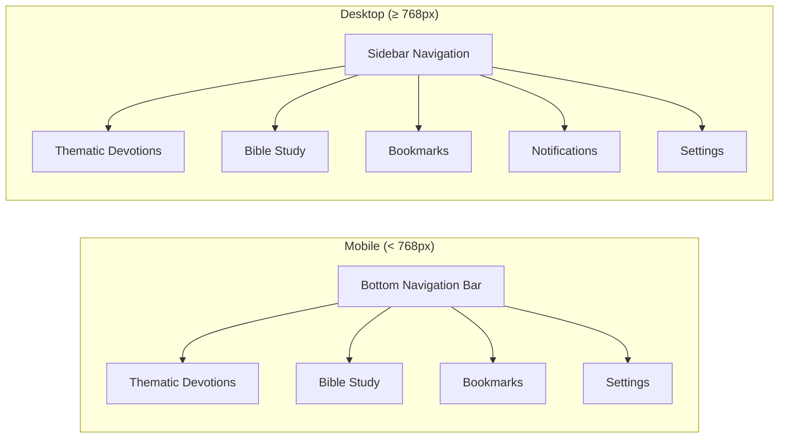
```mermaid
graph LR
    subgraph Mobile["Mobile (< 768px)"]
        BottomNav["Bottom Navigation Bar"]
        BottomNav --> Devotions["Thematic Devotions"]
        BottomNav --> BibleStudy["Bible Study"]
        BottomNav --> Bookmarks["Bookmarks"]
        BottomNav --> Settings["Settings"]
    end

    subgraph Desktop["Desktop (≥ 768px)"]
        Sidebar["Sidebar Navigation"]
        Sidebar --> Devotions2["Thematic Devotions"]
        Sidebar --> BibleStudy2["Bible Study"]
        Sidebar --> Bookmarks2["Bookmarks"]
        Sidebar --> Notifications["Notifications"]
        Sidebar --> Settings2["Settings"]
    end
```

## Components and Interfaces

### Backend Components

#### Models

| Model | Purpose |
|-------|---------|
| `User` | Extended with `partner_id`, `is_admin` boolean, notification preferences, and social account relationships |
| `SocialAccount` | Stores OAuth provider data (provider name, provider ID, tokens) linked to a User |
| `EmailOtp` | Stores hashed OTP codes with email, expiry, and attempt tracking for passwordless email login |
| `Theme` | Devotional topic grouping (admin-created, global). Has `status` (draft/published) and `created_by` referencing the admin who created it |
| `DevotionalEntry` | Individual devotional content within a theme (admin-created). Has `status` (draft/published) |
| `ScriptureCache` | Cached Bible passage text from API |
| `ReadingPlan` | Bible reading plan definition |
| `ReadingPlanProgress` | User's progress through a reading plan |
| `WordStudy` | Greek/Hebrew word study data (seeded) |
| `Bookmark` | Polymorphic bookmark (devotional, scripture, word study) — per-user |
| `DevotionalCompletion` | Per-user completion record for devotional entries |
| `Observation` | User notes/reflections on devotional entries — per-user |
| `Notification` (Laravel built-in) | Partner activity notifications |
| `GeneratedImage` | AI-generated image associated with a devotional entry |
| `AiGenerationLog` | Tracks AI content generation requests via Prism — stores prompt, generated output, admin who requested, and approval status |

#### Actions

| Action | Purpose |
|--------|---------|
| `CreateTheme` | Create a new devotional theme (admin-only) |
| `UpdateTheme` | Update theme name/description (admin-only) |
| `DeleteTheme` | Delete theme and cascade entries (admin-only) |
| `PublishTheme` | Change theme status from draft to published (admin-only) |
| `CreateDevotionalEntry` | Create entry with scripture refs (admin-only) |
| `UpdateDevotionalEntry` | Update entry content (admin-only) |
| `DeleteDevotionalEntry` | Delete entry with confirmation (admin-only) |
| `PublishDevotionalEntry` | Change entry status from draft to published (admin-only) |
| `ReorderDevotionalEntries` | Update display order within theme (admin-only) |
| `GenerateDevotionalContent` | Takes a prompt, calls Laravel AI SDK (Prism), returns structured devotional content (title, body, scripture refs, reflection prompts, Adventist insights). Admin reviews and edits before saving. (admin-only) |
| `CompleteDevotionalEntry` | Mark entry as complete for a user |
| `FetchScripturePassage` | Fetch and cache Bible passage from API |
| `ActivateReadingPlan` | Start a reading plan for a user |
| `CompleteReadingDay` | Mark a reading plan day as complete |
| `CreateBookmark` | Create a polymorphic bookmark |
| `DeleteBookmark` | Remove a bookmark |
| `CreateObservation` | Add observation to a devotional entry |
| `UpdateObservation` | Edit an observation |
| `DeleteObservation` | Remove an observation |
| `GenerateDevotionalImage` | Call OpenAI DALL-E to generate image |
| `SendPartnerNotification` | Dispatch notification to partner |
| `LinkPartner` | Link two users as devotional partners |
| `HandleSocialLogin` | Handle OAuth callback: find or create user and social account |
| `DisconnectSocialAccount` | Remove a linked social account from a user |
| `SendEmailOtp` | Generate a 6-digit OTP, hash it, store in `email_otps` table with 10-minute expiry, and send to the user's email via Laravel Mail |
| `VerifyEmailOtp` | Validate the OTP code against the stored hash, check expiry and attempt count, authenticate the user on success, and delete the OTP record |

#### Controllers

| Controller | Routes |
|------------|--------|
| `Admin\ThemeController` | Admin CRUD for themes (create, edit, delete, publish) |
| `Admin\DevotionalEntryController` | Admin CRUD for entries within themes (create, edit, delete, publish) |
| `Admin\AiContentController` | AI content generation interface — submit prompt, review generated content |
| `ThemeController` | Public read-only: list published themes, show published theme |
| `DevotionalEntryController` | Public read-only: show published entries within published themes |
| `ScriptureController` | Fetch/display scripture passages |
| `ReadingPlanController` | Reading plan management and progress |
| `WordStudyController` | Word study lookups |
| `BookmarkController` | Bookmark CRUD |
| `ObservationController` | Observation CRUD on entries |
| `DevotionalImageController` | AI image generation |
| `NotificationController` | Notification center and preferences |
| `PartnerController` | Partner linking |
| `SocialLoginController` | OAuth redirect and callback handling via Socialite |
| `EmailOtpController` | Handle OTP request (POST email) and OTP verification (POST code) endpoints |

### Frontend Components

#### Pages (`resources/js/pages/`)

| Page | Route | Description |
|------|-------|-------------|
| `themes/index` | `/themes` | Published theme listing with progress |
| `themes/show` | `/themes/{theme}` | Published theme detail with entry list |
| `devotional-entries/show` | `/themes/{theme}/entries/{entry}` | Daily devotional view (published entries only) |
| `admin/themes/index` | `/admin/themes` | Admin theme management (all statuses) |
| `admin/themes/create` | `/admin/themes/create` | Admin create new theme |
| `admin/themes/edit` | `/admin/themes/{theme}/edit` | Admin edit theme |
| `admin/devotional-entries/index` | `/admin/themes/{theme}/entries` | Admin entry management for a theme |
| `admin/devotional-entries/create` | `/admin/themes/{theme}/entries/create` | Admin create entry (manual or AI-assisted) |
| `admin/devotional-entries/edit` | `/admin/themes/{theme}/entries/{entry}/edit` | Admin edit entry |
| `admin/ai-content/generate` | `/admin/ai-content/generate` | AI content generation interface — enter prompt, review/edit generated content |
| `bible-study/index` | `/bible-study` | Bible study dashboard |
| `bible-study/reading-plan` | `/bible-study/reading-plan` | Reading plan progress |
| `bible-study/word-study` | `/bible-study/word-study/{word}` | Word study detail |
| `bookmarks/index` | `/bookmarks` | Bookmarks grouped by type |
| `notifications/index` | `/notifications` | Notification center |
| `auth/email-otp` | `/auth/email-otp` | Email input page for OTP login |
| `auth/email-otp-verify` | `/auth/email-otp/verify` | OTP code entry and verification page |

#### App Components (`resources/js/components/`)

| Component | Purpose |
|-----------|---------|
| `devotional-layout` | Mobile-first layout with bottom/sidebar nav |
| `bottom-nav` | Mobile bottom navigation bar |
| `scripture-passage` | Inline scripture display with version selector |
| `bible-version-selector` | Dropdown to switch Bible versions |
| `completion-indicator` | Visual completion status (self, partner, both) |
| `progress-bar` | Theme/reading plan progress visualization |
| `observation-form` | Add/edit observation form |
| `observation-list` | Chronological observation display |
| `bookmark-button` | Toggle bookmark on content |
| `image-generator` | AI image generation button with loading state |
| `offline-indicator` | Banner showing offline status |
| `notification-badge` | Unread notification count |
| `word-study-popover` | Popover for word study on tap |
| `confirmation-dialog` | Reusable delete confirmation |
| `entry-navigator` | Previous/next entry navigation |

## Screen Designs

The application follows the "Editorial Serenity" design system — a high-end editorial aesthetic inspired by boutique journals and architectural monographs. The visual language uses parchment backgrounds (`#FCF9F2`), Newsreader serif for headlines, Inter sans-serif for body/UI text, moss green (`#56642B`) accents, and depth through surface layering rather than borders. See `screens/editorial_serenity/DESIGN.md` for the full design system specification.

### User-Facing Screens

#### Themes Index — Desktop


Desktop layout with fixed sidebar navigation (Themes, All Entries, Analytics, Settings), glassmorphic top navigation bar with section links (Devotions, Bible Study, Bookmarks), and a two-column theme card grid. Each card shows a cover image, published/in-progress status chip, title, description, progress bar with completion percentage, and a CTA button. An overall progress summary card sits in the header area.

#### Themes Index — Desktop with Refined Heading and Featured Series


Alternate desktop layout featuring a prominent featured series hero section (full-width cover image with overlay text and "Explore Series" CTA), followed by a "Continue Your Journey" grid of theme cards. The overall progress indicator is integrated into the section header. Account popover menu is visible from the sidebar user profile area with Profile Settings, Partner Linking, Notifications, and Sign Out options.

#### Themes Index — Mobile (Default)

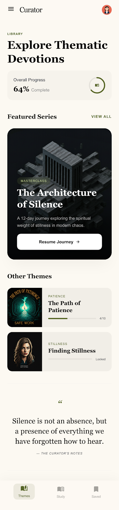

Mobile layout with compact top app bar (hamburger menu, "Curator" branding, profile avatar), circular progress indicator, a featured series card with full-bleed cover image and gradient overlay, and a compact horizontal theme card list. Bottom navigation bar with Themes, Study, and Saved tabs.

#### Themes Index — Mobile (Menu Open)


Mobile navigation drawer overlay showing user profile section, navigation links (Profile, Settings, Partner Linking, Sign Out), and app version. Background content is dimmed and blurred when the drawer is open.

#### Theme Detail — Desktop

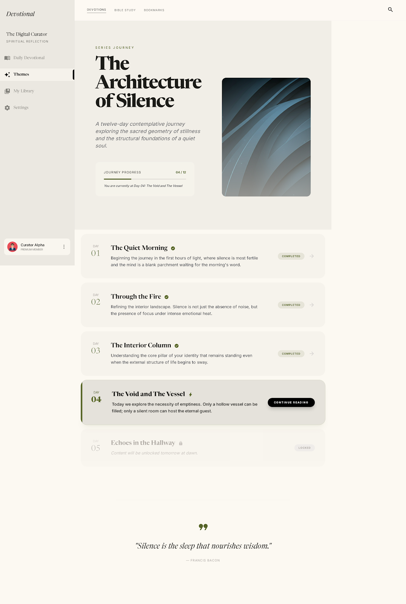

Desktop theme detail view showing the theme's devotional entries in a structured list with the sidebar navigation. Entries display their title, scripture references, completion status, and sequential ordering within the theme.

#### Theme Detail — Mobile

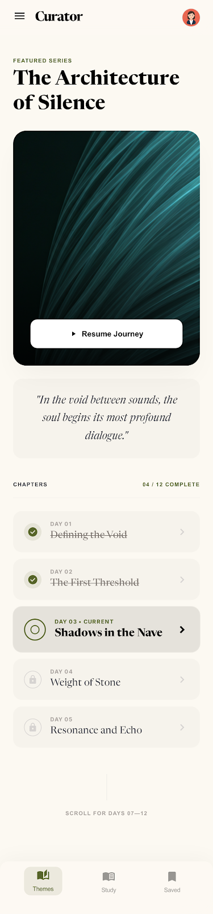

Mobile theme detail view with a compact entry list, progress tracking, and navigation controls to browse entries within the selected theme.

#### Daily Devotional Reading — Desktop

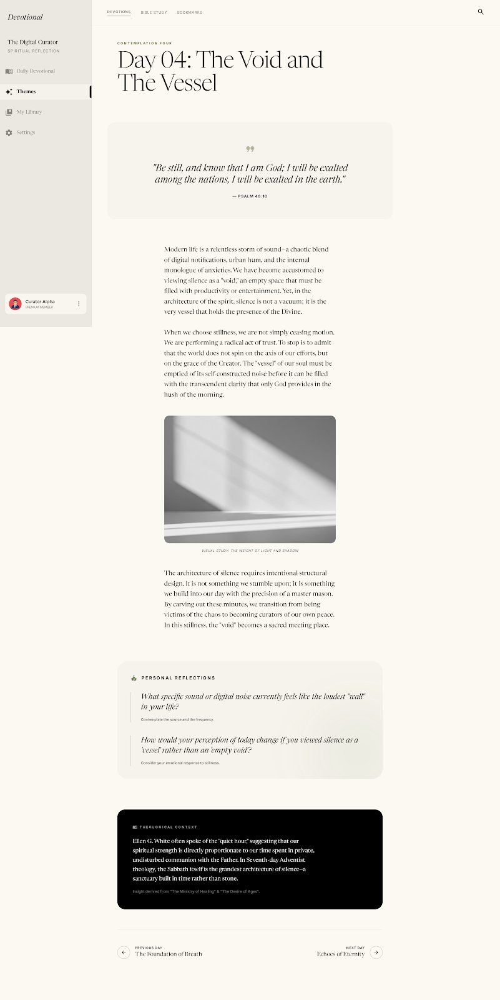

Full devotional entry reading view on desktop with the sidebar navigation. Displays the entry title, scripture passage text (with Bible version selector), devotional body content, reflection prompts, and Adventist insights in a single scrollable view. Includes previous/next entry navigation and completion controls.

#### Daily Devotional Reading — Mobile

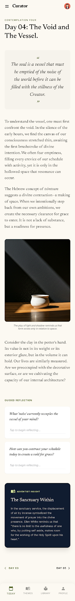

Mobile-optimized devotional reading view with readable font sizes (16px+ body), adequate line spacing (1.5+), and touch-friendly navigation controls. Scripture passages render inline with the devotional content.

#### Bible Study Dashboard

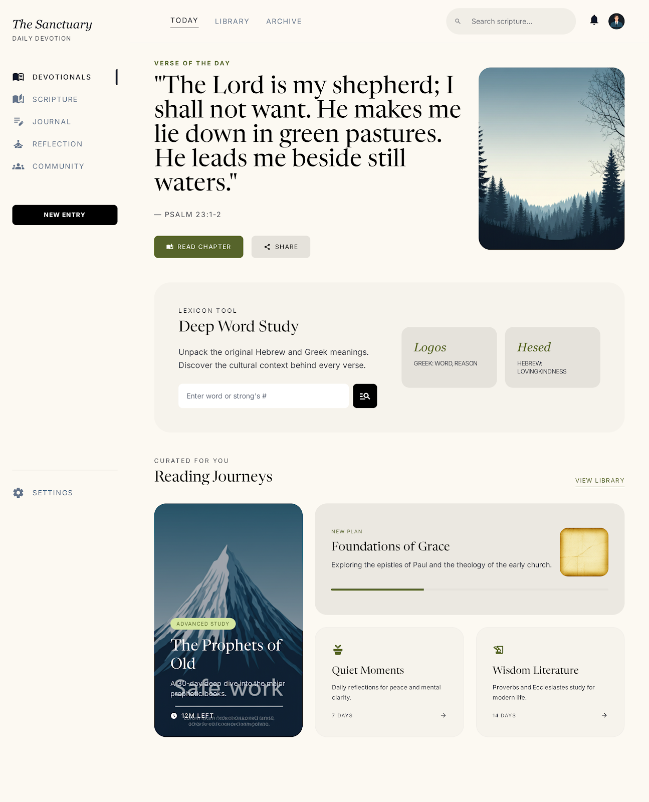

Desktop Bible Study mode with sidebar navigation. Features a "Verse of the Day" hero section with scripture quote and action buttons, a "Deep Word Study" lexicon tool with search input and sample Greek/Hebrew word cards, and a "Reading Journeys" section with an asymmetric card grid showing reading plans (vertical large card, horizontal cards, and compact cards) with progress indicators and time estimates.

#### Bible Study Dashboard — Mobile


Mobile Bible Study dashboard with bottom navigation, compact verse of the day section, word study search, and vertically stacked reading plan cards.

#### Reading Plan Progress

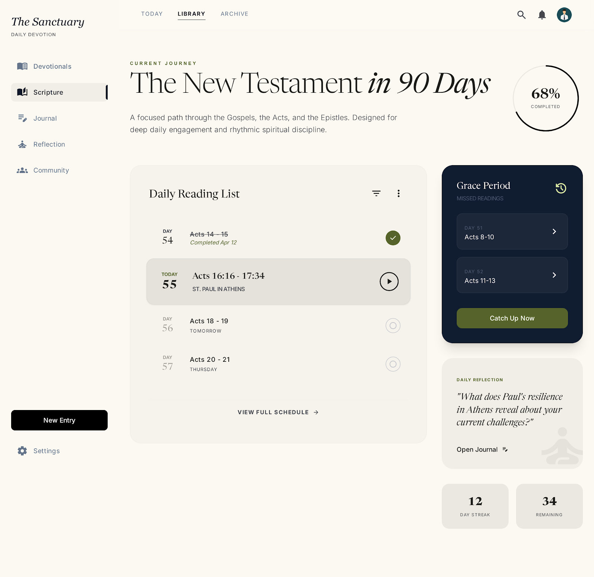

Desktop reading plan detail view showing "The New Testament in 90 Days" with a circular 68% progress visualization. Features a daily reading list with completed (strikethrough), current (highlighted), and upcoming entries. Right sidebar shows a "Grace Period" section for missed readings with catch-up option, a daily reflection prompt, and stats cards (day streak, remaining days).

#### Reading Plan Progress — Mobile

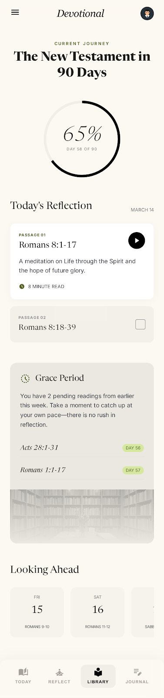

Mobile reading plan progress view with compact circular progress indicator, vertically stacked daily reading list, and missed readings section below the main list.

#### Word Study Detail

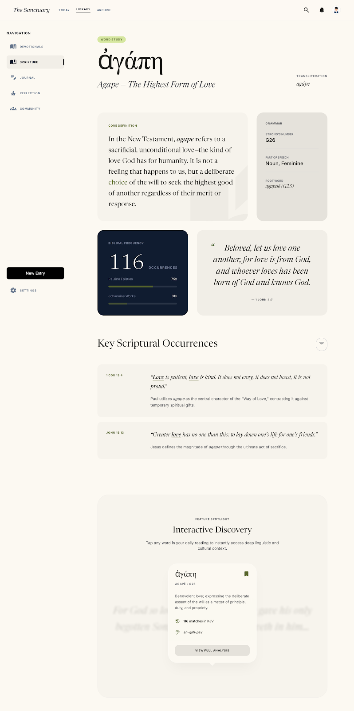

Desktop word study page for "ἀγάπη (Agape)" with editorial hero showing the Greek word, transliteration, and subtitle. Bento grid layout includes a core definition card, grammatical context (Strong's number G26, part of speech, root word), biblical frequency visualization (116 occurrences with bar charts for Pauline Epistles and Johannine Works), a pull-quote from 1 John 4:7, key scriptural occurrences list, and an interactive word study popover mockup showing how tapping a word in scripture reveals its linguistic context.

#### Word Study Detail — Mobile

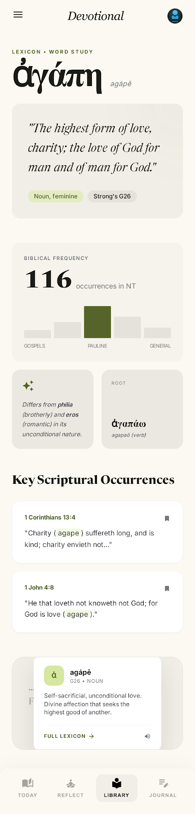

Mobile word study view with the Greek word and transliteration stacked vertically, single-column definition and grammar sections, and the word study popover adapted for touch interaction on smaller viewports.

#### Bookmarks

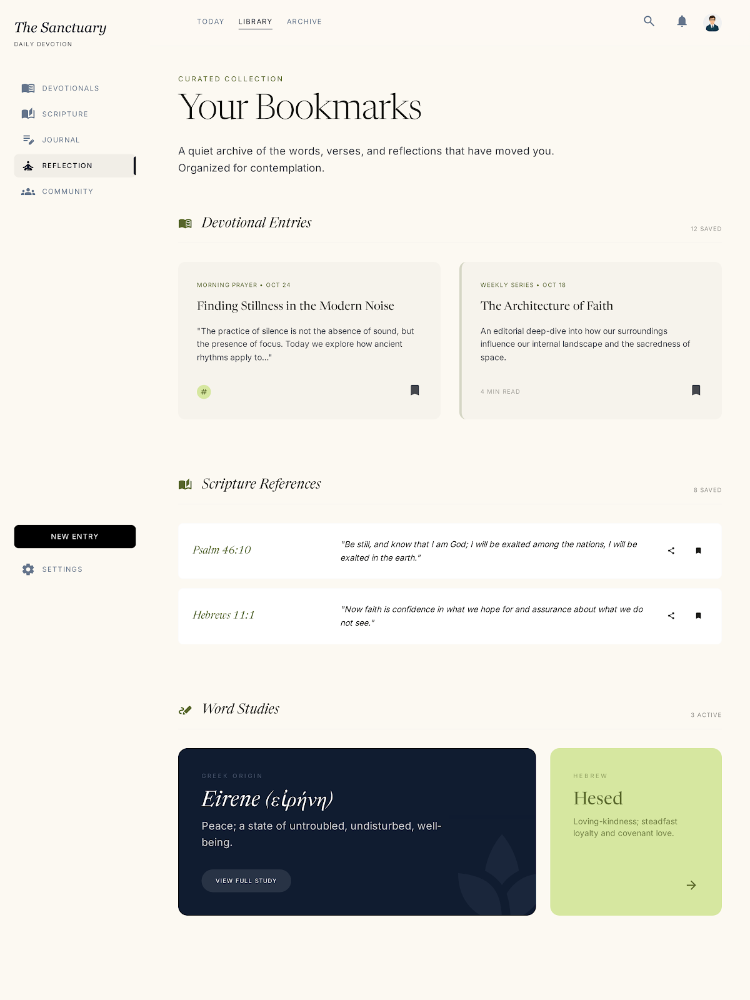

Desktop bookmarks page with sidebar navigation. Bookmarks are grouped into three sections: Devotional Entries (card layout with title, excerpt, date, and filled bookmark icon), Scripture References (list layout with verse reference, passage text, share and bookmark actions), and Word Studies (bento-style cards with Greek/Hebrew words, definitions, and dark/accent backgrounds for visual hierarchy).

#### Bookmarks — Mobile


Mobile bookmarks page with bottom navigation, single-column layout, and the same three grouped sections (Devotional Entries, Scripture References, Word Studies) adapted for compact viewports.

#### Notifications / Notification Center

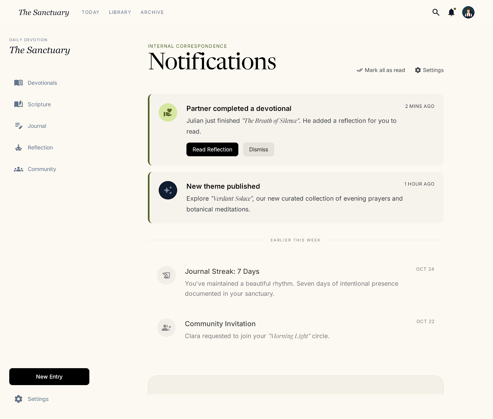

Desktop notification center with editorial header, "Mark all as read" and "Settings" actions. Unread notifications have a green left border accent and action buttons (e.g., "Read Reflection", "Dismiss"). Read notifications are grouped under a "Earlier This Week" divider with reduced opacity. Notification types include partner completions, new theme publications, journal streaks, and community invitations. Footer CTA links to notification preferences.

#### Notifications — Mobile

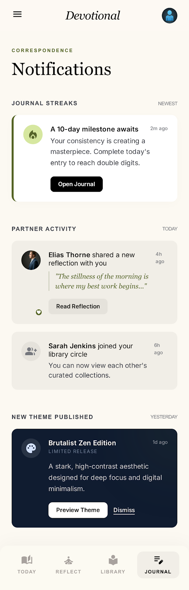

Mobile notification center with bottom navigation, compact notification cards, and the same unread/read grouping adapted for single-column mobile layout.

#### Settings

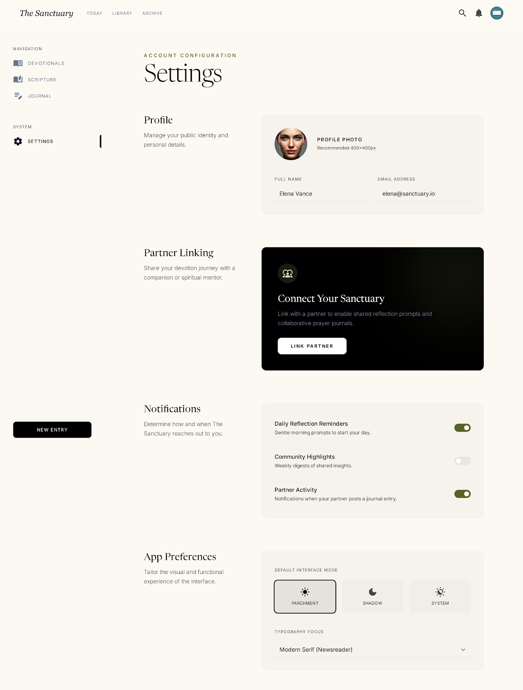

Desktop settings page with a two-column layout (label/description on left, controls on right). Sections include Profile (photo upload, name, email fields), Partner Linking (dark hero card with "Link Partner" CTA), Notifications (toggle switches for daily reminders, community highlights, partner activity), and App Preferences (theme mode selector with Parchment/Shadow/System options, typography focus dropdown).

#### Settings — Mobile

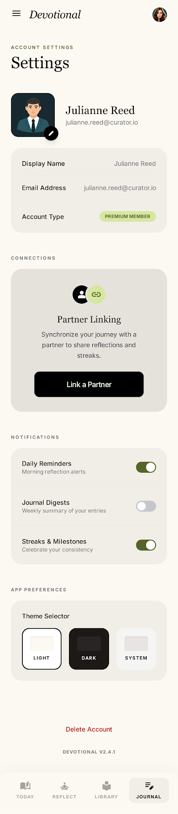

Mobile settings page with single-column stacked sections, full-width form controls, and bottom navigation.

#### Observations Section


Desktop devotional entry view focused on the observations/reflections feature. Left column shows a rich text editor for personal observations with formatting toolbar, auto-save indicator, and "Lock Entry" button. A pull-quote from the scripture is displayed below. Right column shows the linked partner's observations in a threaded timeline layout with avatar, timestamps, tags, and a quick reply input area. Additional context cards show historical background and a morning reflection prompt.

#### Observations Section — Mobile

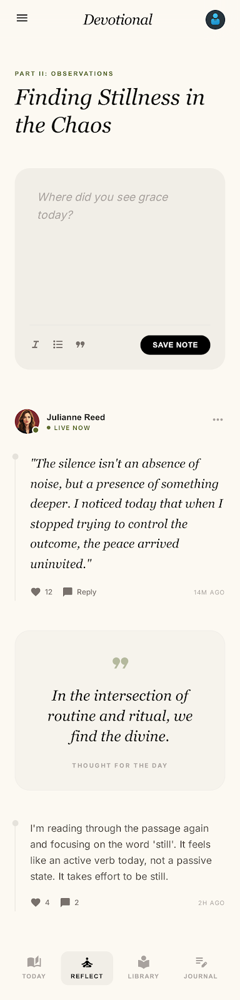

Mobile observations view with single-column layout, personal observation editor stacked above partner observations, and compact reply input.

#### Offline Mode

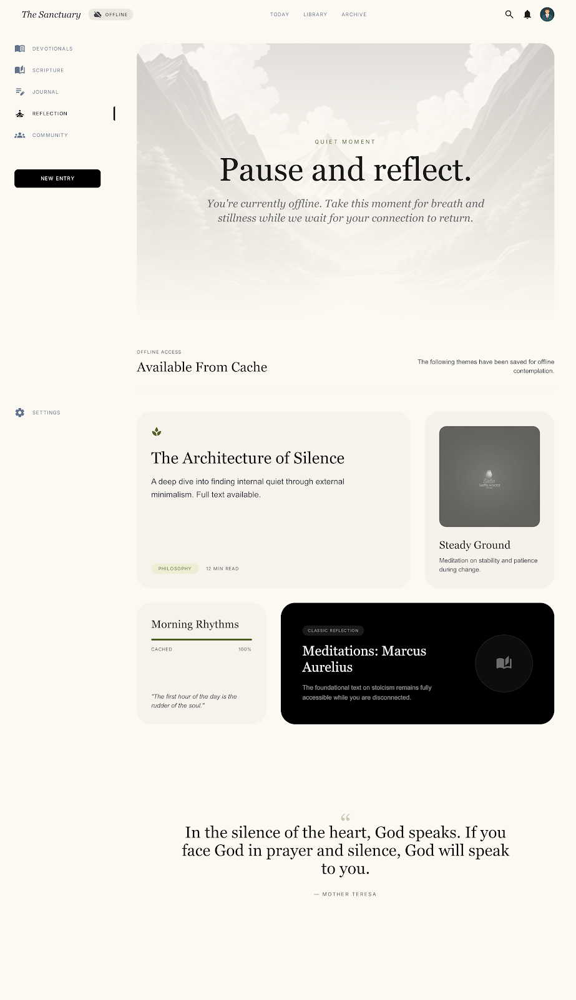

Desktop offline fallback page with a "cloud_off" indicator in the top nav bar. Features a hero section with a grayscale misty landscape and messaging: "Pause and reflect. You're currently offline." Below, an "Available From Cache" section shows previously viewed themes in a bento grid layout with cache status indicators. Includes a pull-quote for contemplation while offline.

#### PWA Install Prompt

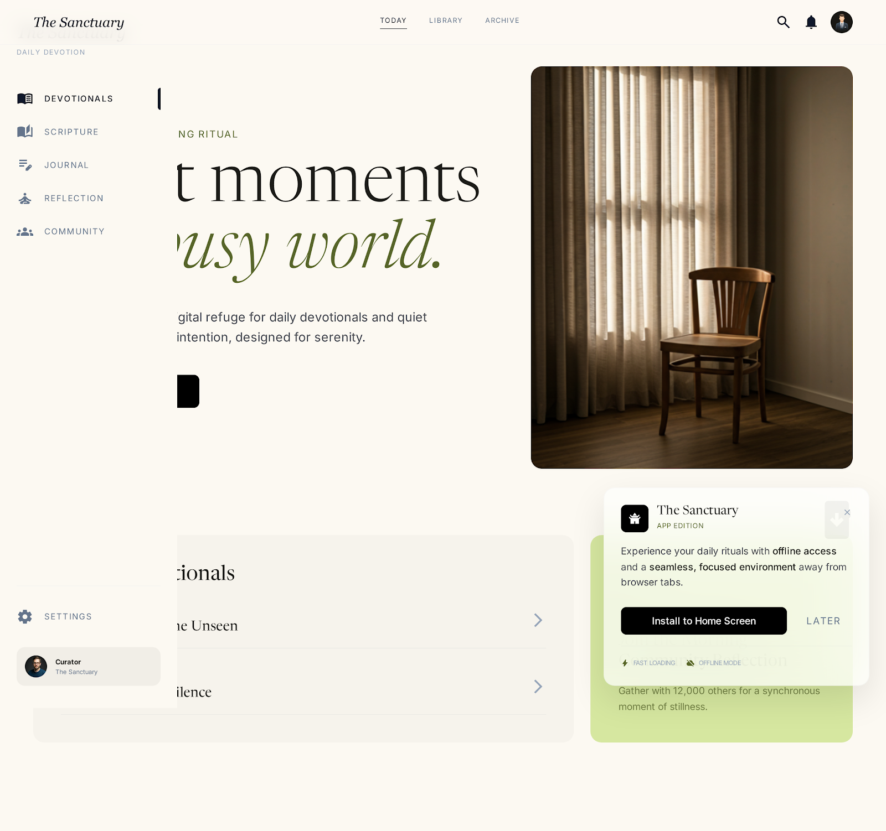

Desktop page with a floating PWA install prompt card in the bottom-right corner. The prompt uses glassmorphic styling with app icon, "The Sanctuary — App Edition" branding, description highlighting offline access and focused environment, "Install to Home Screen" primary button, "Later" dismiss option, and benefit badges (Fast Loading, Offline Mode). The background shows the main devotional content page.

#### Account Popover — Desktop

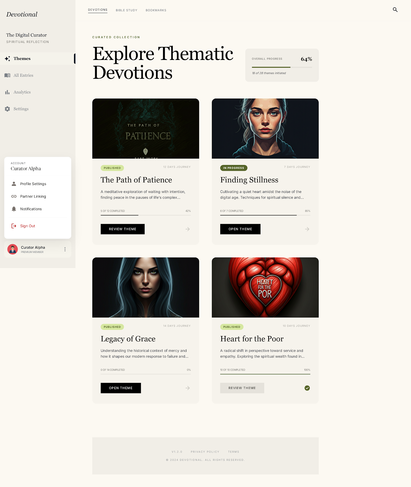

Desktop account popover menu triggered from the sidebar user profile. Shows account label, user name, and menu items: Profile Settings, Partner Linking, Notifications, and Sign Out. Uses the surface-container-lowest background with subtle shadow elevation.

### Auth Screens

#### Welcome / Login — Desktop


Split-layout login page with a full-height nature photograph on the left half and the auth form on the right. The form presents three social login buttons (Continue with Google, Continue with Apple, Continue with GitHub), an "or" divider, and a "Login with Email" button for OTP flow. Includes "Request access" link for new users and a footer with privacy/terms links.

#### Welcome / Login — Mobile


Mobile-optimized login page with the same social login buttons and email OTP option in a single-column layout, without the side photograph.

#### Email OTP — Enter Email (Desktop)


Centered card layout with a lock icon, "Secure Access" label, "Enter Your Email" headline, and a minimalist bottom-border email input field. "Send Code" CTA button and a "Back to social login" link. Decorative background text ("Curate") adds editorial flair.

#### Email OTP — Enter Email (Mobile)


Mobile-optimized email entry page with the same centered card layout adapted for smaller viewports.

#### Email OTP — Verify Code (Desktop)

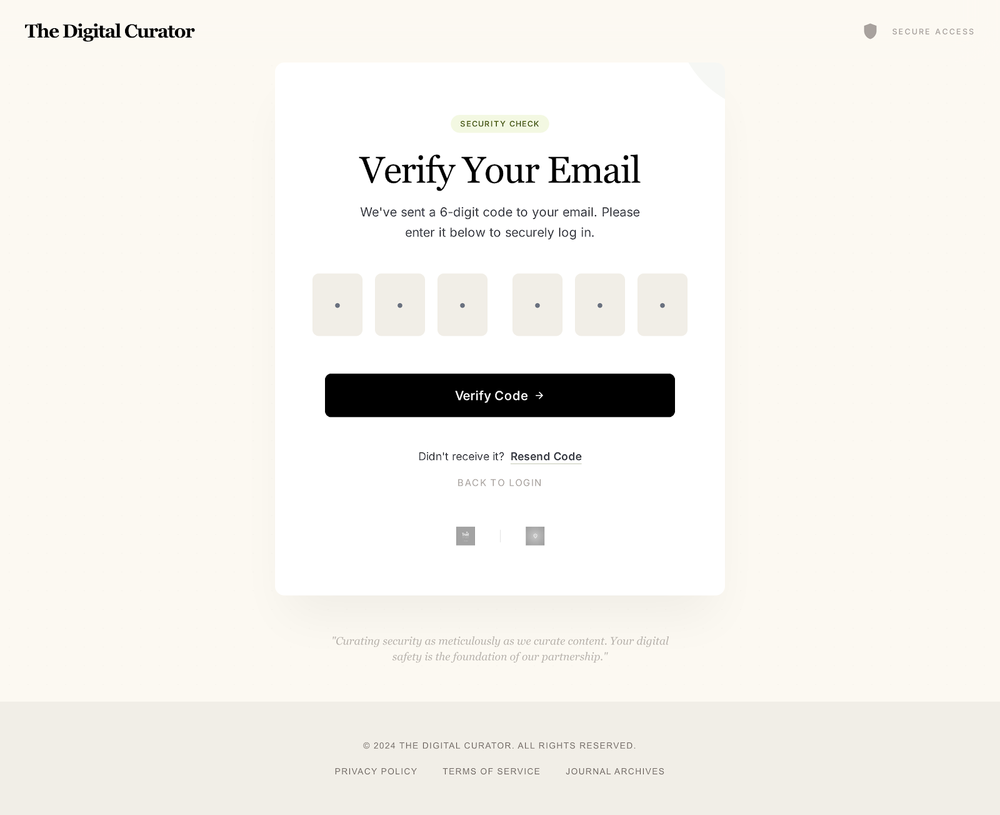

Centered verification card with "Security Check" chip, "Verify Your Email" headline, and six individual OTP digit input boxes (3 + gap + 3 layout). Features "Verify Code" primary button, "Resend Code" link, and "Back to Login" navigation. Trust/security badges at the bottom.

#### Email OTP — Verify Code (Alternate)


Alternate OTP verification layout.

#### Email OTP — Verify Code (Mobile)

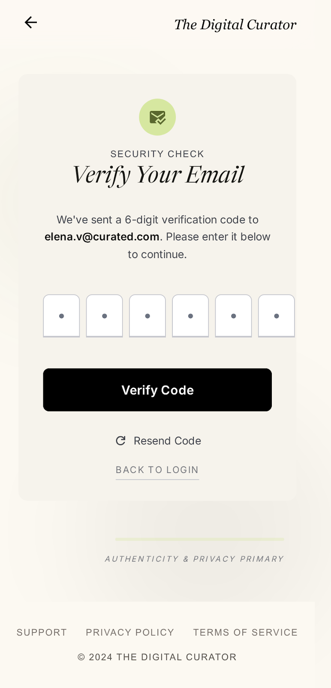

Mobile-optimized OTP verification page with touch-friendly digit input boxes.

### Admin Screens

#### Admin Themes Index — Desktop

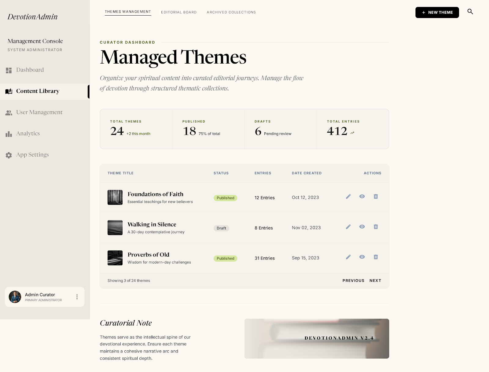

Admin theme management dashboard showing all themes (both draft and published) with status indicators, entry counts, and action buttons for editing, publishing, and deleting. Follows the same editorial design language as the user-facing screens.

#### Admin Themes Index — Mobile

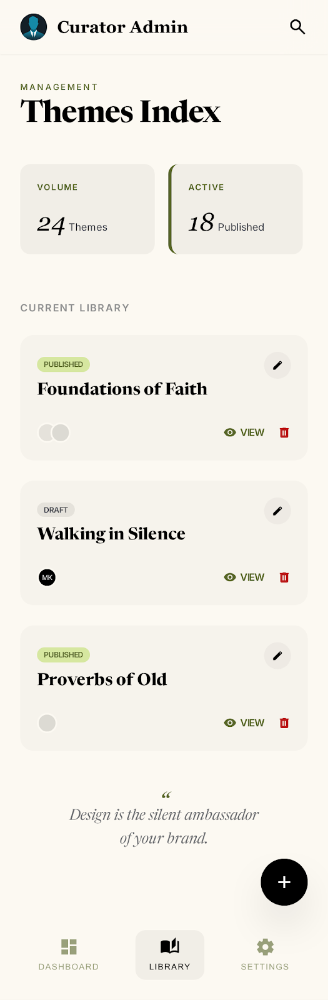

Mobile admin theme management view with compact theme cards showing status chips (draft/published), entry counts, and quick action controls.

#### Admin Create New Theme — Desktop

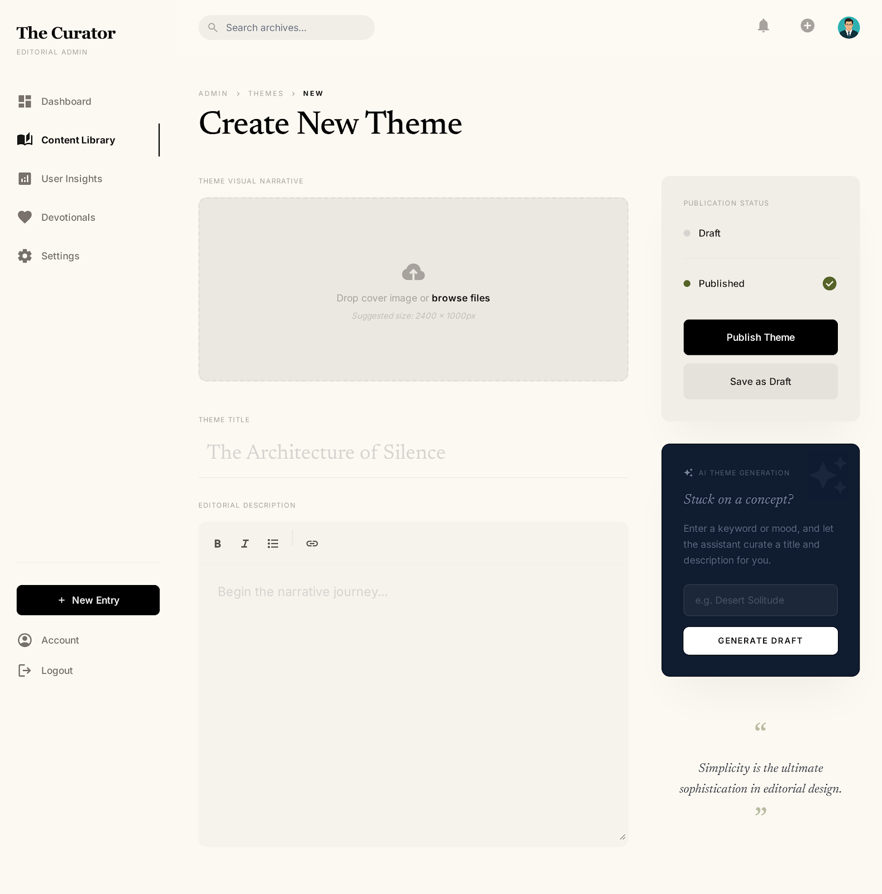

Admin theme creation form with fields for theme name, description, and cover image upload. Follows the minimalist input field style from the design system (bottom-border inputs, surface-container fills on focus).

#### Admin Create New Theme — Mobile


Mobile-optimized admin theme creation form with full-width inputs and touch-friendly form controls.

#### Admin Devotional Entry List

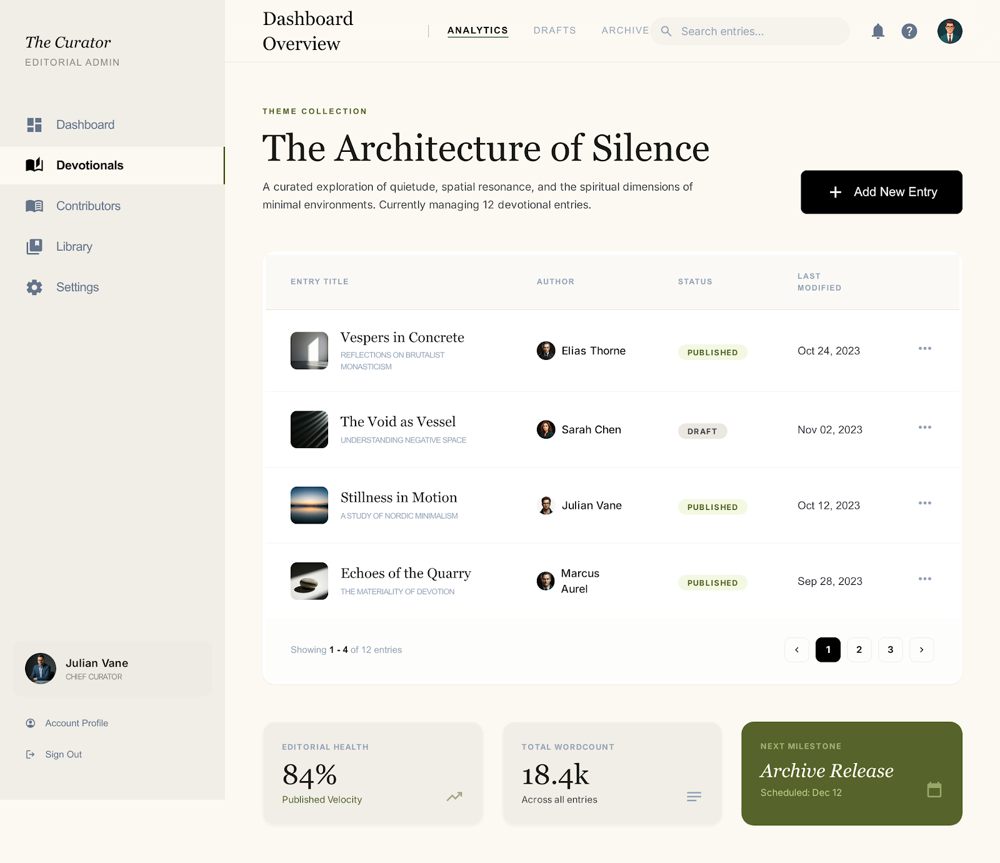

Admin entry management table for a theme ("The Architecture of Silence"). Shows entries in a data table with thumbnail, title, subtitle, author avatar/name, status chip (Published/Draft), last modified date, and action menu. Includes search, pagination (1-4 of 12), and summary bento cards showing editorial health (84% published velocity), total wordcount (18.4k), and next milestone (archive release date).

#### Admin Devotional Entry List — Mobile


Mobile admin entry list with compact card-based layout replacing the data table, status chips, and quick action controls.

#### Admin Create Devotional Entry — Manual

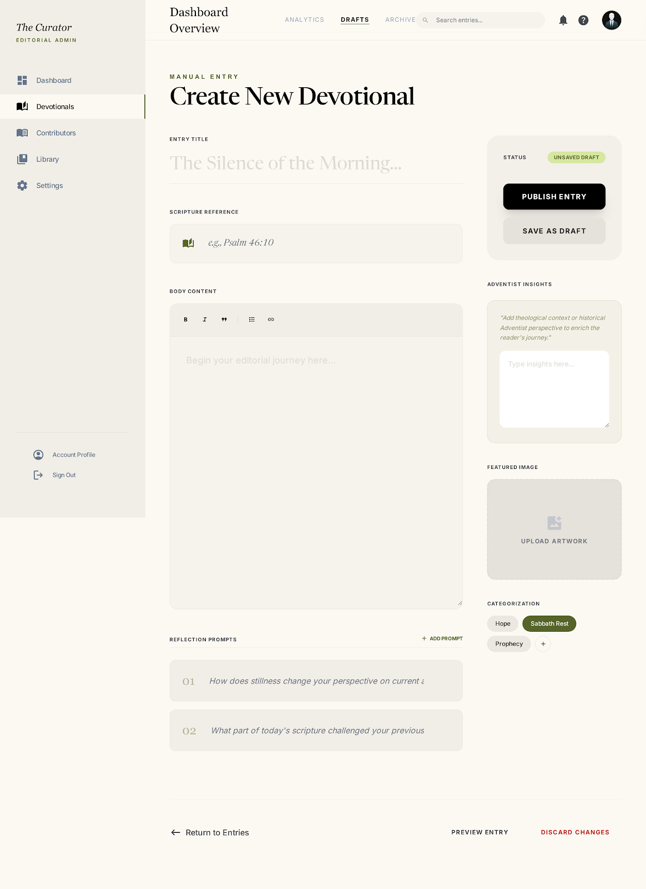

Admin manual entry creation form with a two-column layout. Left column (8/12) has the entry title (large serif input), scripture reference field with book icon, body content rich text editor with formatting toolbar, and numbered reflection prompts with add/delete controls. Right column (4/12) has a sticky sidebar with publication status (Unsaved Draft), Publish/Save as Draft buttons, Adventist Insights textarea, featured image upload dropzone, and categorization tags (Hope, Sabbath Rest, Prophecy).

#### Admin Edit Devotional Entry

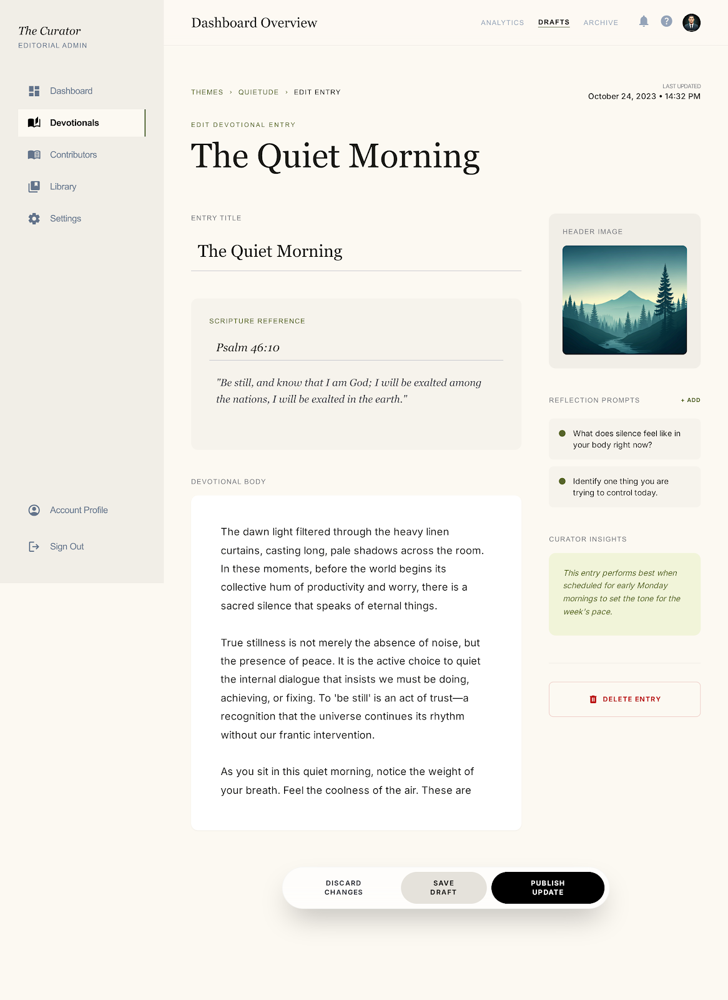

Admin entry edit form pre-populated with existing content ("The Quiet Morning"). Same two-column layout as create, with breadcrumb navigation (Themes > Quietude > Edit Entry), last updated timestamp, pre-filled title/scripture/body fields, header image with replace overlay, reflection prompts, curator insights textarea, and a "Delete Entry" danger zone button. Floating glassmorphic action bar at the bottom with Discard Changes, Save Draft, and Publish Update buttons.

#### Admin Create/Edit Devotional Entry — Mobile

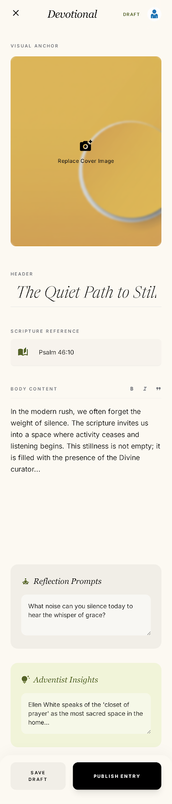

Mobile admin entry create/edit form with single-column stacked layout, full-width inputs, and bottom-anchored action buttons.

#### Admin AI Content Generation

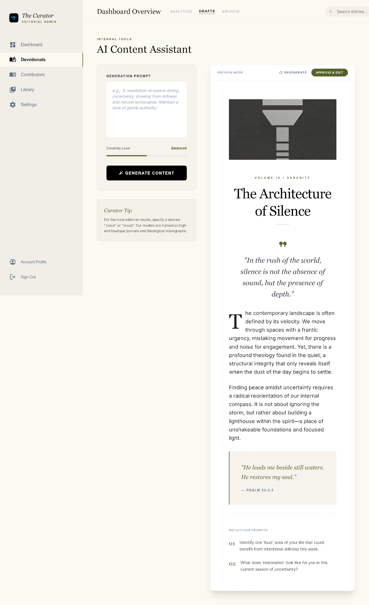

Admin AI content assistant with a two-column layout. Left panel (5/12) has a generation prompt textarea, creativity level slider, "Generate Content" button with sparkle icon, and a "Curator Tip" card with guidance on specifying voice/mood. Right panel (7/12) shows a live preview canvas with a glassy toolbar (Preview Mode label, Regenerate and "Approve & Edit" buttons). The preview renders the generated devotional in full editorial format: hero image, volume/series label, title, pull-quote, body text with drop cap, scripture reference block with left border accent, and numbered reflection prompts.

#### Admin AI Content Generation — Mobile

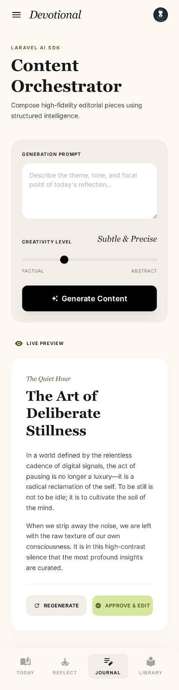

Mobile admin AI content generation with stacked layout — prompt input and controls on top, generated content preview below with scrollable preview area.

## Data Models

### ERD

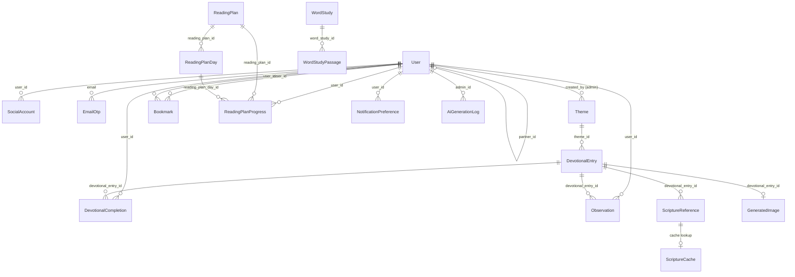
```mermaid
erDiagram
    User ||--o| User : "partner_id"
    User ||--o{ SocialAccount : "user_id"
    User ||--o{ EmailOtp : "email"
    User ||--o{ Theme : "created_by (admin)"
    User ||--o{ DevotionalCompletion : "user_id"
    User ||--o{ Bookmark : "user_id"
    User ||--o{ Observation : "user_id"
    User ||--o{ ReadingPlanProgress : "user_id"
    User ||--o{ NotificationPreference : "user_id"
    User ||--o{ AiGenerationLog : "admin_id"

    Theme ||--o{ DevotionalEntry : "theme_id"

    DevotionalEntry ||--o{ ScriptureReference : "devotional_entry_id"
    DevotionalEntry ||--o{ DevotionalCompletion : "devotional_entry_id"
    DevotionalEntry ||--o{ Observation : "devotional_entry_id"
    DevotionalEntry ||--o| GeneratedImage : "devotional_entry_id"

    ScriptureReference ||--o| ScriptureCache : "cache lookup"

    ReadingPlan ||--o{ ReadingPlanDay : "reading_plan_id"
    ReadingPlan ||--o{ ReadingPlanProgress : "reading_plan_id"
    ReadingPlanDay ||--o{ ReadingPlanProgress : "reading_plan_day_id"

    WordStudy ||--o{ WordStudyPassage : "word_study_id"

    Bookmark }o--|| User : "user_id"
```

### Migration Schemas

#### `users` table (modify existing)

```php
// Add to existing users migration or create new migration
$table->foreignId('partner_id')->nullable()->constrained('users')->nullOnDelete();
$table->boolean('is_admin')->default(false);
// Note: password column should be nullable to support social-only login users
// $table->string('password')->nullable()->change();
```

#### `social_accounts` table

```php
Schema::create('social_accounts', function (Blueprint $table): void {
    $table->id();
    $table->foreignId('user_id')->constrained()->cascadeOnDelete();
    $table->string('provider'); // 'google', 'apple', 'github'
    $table->string('provider_id');
    $table->string('provider_token')->nullable();
    $table->string('provider_refresh_token')->nullable();
    $table->timestamps();

    $table->unique(['provider', 'provider_id']);
    $table->unique(['user_id', 'provider']);
});
```

#### `email_otps` table

```php
Schema::create('email_otps', function (Blueprint $table): void {
    $table->id();
    $table->string('email')->index();
    $table->string('code_hash'); // Hashed 6-digit OTP via Hash::make()
    $table->unsignedTinyInteger('attempts')->default(0); // Max 3 failed attempts
    $table->timestamp('expires_at');
    $table->timestamps();
});
```

#### `themes` table

```php
Schema::create('themes', function (Blueprint $table): void {
    $table->id();
    $table->foreignId('created_by')->constrained('users')->cascadeOnDelete(); // References the admin who created it
    $table->string('name')->unique();
    $table->text('description')->nullable();
    $table->string('status')->default('draft'); // 'draft' or 'published'
    $table->timestamps();
});
```

#### `devotional_entries` table

```php
Schema::create('devotional_entries', function (Blueprint $table): void {
    $table->id();
    $table->foreignId('theme_id')->constrained()->cascadeOnDelete();
    $table->string('title');
    $table->longText('body');
    $table->text('reflection_prompts')->nullable();
    $table->text('adventist_insights')->nullable();
    $table->unsignedInteger('display_order')->default(0);
    $table->string('status')->default('draft'); // 'draft' or 'published'
    $table->timestamps();
});
```

#### `scripture_references` table

```php
Schema::create('scripture_references', function (Blueprint $table): void {
    $table->id();
    $table->foreignId('devotional_entry_id')->constrained()->cascadeOnDelete();
    $table->string('book');
    $table->unsignedSmallInteger('chapter');
    $table->unsignedSmallInteger('verse_start');
    $table->unsignedSmallInteger('verse_end')->nullable();
    $table->string('raw_reference'); // e.g., "John 3:16"
    $table->timestamps();
});
```

#### `scripture_caches` table

```php
Schema::create('scripture_caches', function (Blueprint $table): void {
    $table->id();
    $table->string('book');
    $table->unsignedSmallInteger('chapter');
    $table->unsignedSmallInteger('verse_start');
    $table->unsignedSmallInteger('verse_end')->nullable();
    $table->string('bible_version', 10); // e.g., "KJV"
    $table->longText('text');
    $table->timestamps();

    $table->unique(['book', 'chapter', 'verse_start', 'verse_end', 'bible_version'], 'scripture_cache_unique');
});
```

#### `reading_plans` table

```php
Schema::create('reading_plans', function (Blueprint $table): void {
    $table->id();
    $table->string('name');
    $table->text('description')->nullable();
    $table->unsignedSmallInteger('total_days')->default(365);
    $table->boolean('is_default')->default(false);
    $table->timestamps();
});
```

#### `reading_plan_days` table

```php
Schema::create('reading_plan_days', function (Blueprint $table): void {
    $table->id();
    $table->foreignId('reading_plan_id')->constrained()->cascadeOnDelete();
    $table->unsignedSmallInteger('day_number');
    $table->json('passages'); // Array of scripture references for the day
    $table->timestamps();

    $table->unique(['reading_plan_id', 'day_number']);
});
```

#### `reading_plan_progress` table

```php
Schema::create('reading_plan_progress', function (Blueprint $table): void {
    $table->id();
    $table->foreignId('user_id')->constrained()->cascadeOnDelete();
    $table->foreignId('reading_plan_id')->constrained()->cascadeOnDelete();
    $table->foreignId('reading_plan_day_id')->constrained()->cascadeOnDelete();
    $table->date('started_at');
    $table->date('completed_at')->nullable();
    $table->timestamps();

    $table->unique(['user_id', 'reading_plan_id', 'reading_plan_day_id'], 'user_plan_day_unique');
});
```

#### `word_studies` table

```php
Schema::create('word_studies', function (Blueprint $table): void {
    $table->id();
    $table->string('original_word'); // Greek/Hebrew word
    $table->string('transliteration');
    $table->string('language', 10); // 'greek' or 'hebrew'
    $table->text('definition');
    $table->string('strongs_number', 10)->unique();
    $table->timestamps();
});
```

#### `word_study_passages` table

```php
Schema::create('word_study_passages', function (Blueprint $table): void {
    $table->id();
    $table->foreignId('word_study_id')->constrained()->cascadeOnDelete();
    $table->string('book');
    $table->unsignedSmallInteger('chapter');
    $table->unsignedSmallInteger('verse');
    $table->string('english_word'); // The English word in this passage
    $table->timestamps();

    $table->unique(['word_study_id', 'book', 'chapter', 'verse'], 'word_passage_unique');
});
```

#### `devotional_completions` table

```php
Schema::create('devotional_completions', function (Blueprint $table): void {
    $table->id();
    $table->foreignId('user_id')->constrained()->cascadeOnDelete();
    $table->foreignId('devotional_entry_id')->constrained()->cascadeOnDelete();
    $table->timestamp('completed_at');
    $table->timestamps();

    $table->unique(['user_id', 'devotional_entry_id']);
});
```

#### `bookmarks` table

```php
Schema::create('bookmarks', function (Blueprint $table): void {
    $table->id();
    $table->foreignId('user_id')->constrained()->cascadeOnDelete();
    $table->morphs('bookmarkable'); // devotional_entry, scripture_reference, or word_study
    $table->timestamps();

    $table->unique(['user_id', 'bookmarkable_type', 'bookmarkable_id']);
});
```

#### `observations` table

```php
Schema::create('observations', function (Blueprint $table): void {
    $table->id();
    $table->foreignId('user_id')->constrained()->cascadeOnDelete();
    $table->foreignId('devotional_entry_id')->constrained()->cascadeOnDelete();
    $table->text('body');
    $table->timestamp('edited_at')->nullable();
    $table->timestamps();
});
```

#### `generated_images` table

```php
Schema::create('generated_images', function (Blueprint $table): void {
    $table->id();
    $table->foreignId('devotional_entry_id')->constrained()->cascadeOnDelete();
    $table->string('path'); // Filesystem path
    $table->text('prompt'); // The prompt sent to AI
    $table->timestamps();
});
```

#### `ai_generation_logs` table

```php
Schema::create('ai_generation_logs', function (Blueprint $table): void {
    $table->id();
    $table->foreignId('admin_id')->constrained('users')->cascadeOnDelete();
    $table->text('prompt'); // The prompt the admin provided
    $table->json('generated_content')->nullable(); // Structured output: title, body, scripture_refs, reflection_prompts, adventist_insights
    $table->string('status'); // 'pending', 'completed', 'failed', 'approved', 'rejected'
    $table->text('error_message')->nullable(); // Error details if generation failed
    $table->foreignId('devotional_entry_id')->nullable()->constrained()->nullOnDelete(); // Linked entry if content was approved and saved
    $table->timestamps();
});
```

#### `notification_preferences` table

```php
Schema::create('notification_preferences', function (Blueprint $table): void {
    $table->id();
    $table->foreignId('user_id')->constrained()->cascadeOnDelete();
    $table->boolean('completion_notifications')->default(true);
    $table->boolean('observation_notifications')->default(true);
    $table->boolean('new_theme_notifications')->default(true);
    $table->boolean('reminder_notifications')->default(true);
    $table->timestamps();

    $table->unique('user_id');
});
```

## Correctness Properties

*A property is a characteristic or behavior that should hold true across all valid executions of a system — essentially, a formal statement about what the system should do. Properties serve as the bridge between human-readable specifications and machine-verifiable correctness guarantees.*

### Property 1: Published devotional entries are returned in sequential display order

*For any* Theme with any number of Devotional Entries at arbitrary `display_order` values and mixed `status` values, querying the entries for that Theme as a regular (non-admin) user SHALL return only published entries, sorted by `display_order` ascending.

**Validates: Requirements 1.2**

### Property 2: Theme progress counts are accurate for published entries

*For any* Theme with N published Devotional Entries where M entries have been completed by a given User, the Theme's reported total count SHALL equal N (published only) and the completed count SHALL equal M, and the completion percentage SHALL equal (M / N) × 100.

**Validates: Requirements 1.3, 8.4**

### Property 3: Devotional entry validation rejects incomplete submissions (admin)

*For any* combination of title, scripture references, and body text where at least one required field is empty or missing, an admin creating or updating a Devotional Entry SHALL be rejected with a validation error.

**Validates: Requirements 2.1, 2.4**

### Property 4: Devotional entry creation round-trip preserves all fields (admin)

*For any* valid Devotional Entry with a title, body, at least one scripture reference, and optional reflection prompts and Adventist insights, an admin creating the entry and then retrieving it SHALL return all provided field values unchanged, with the entry associated to exactly one Theme and a default status of `draft`.

**Validates: Requirements 2.2, 2.3**

### Property 5: Reordering entries persists the requested permutation

*For any* Theme with N entries and any valid permutation of their display order, applying the reorder operation and then querying the entries SHALL return them in the new requested order.

**Validates: Requirements 2.6**

### Property 6: Scripture reference parsing round-trip

*For any* valid scripture reference string in standard format (e.g., "John 3:16", "Psalm 23:1-6"), parsing the string into a structured ScriptureReference and formatting it back to a string SHALL produce an equivalent reference string.

**Validates: Requirements 3.5**

### Property 7: Reading plan day calculation is correct for any start date

*For any* Reading Plan activation with a given start date, the day number for any subsequent date SHALL equal the number of days elapsed since the start date plus one, and the assigned passages SHALL match the Reading Plan's definition for that day number.

**Validates: Requirements 4.2, 4.3**

### Property 8: Reading plan progress percentage is accurate

*For any* Reading Plan with T total days where a User has completed C days, the reported progress percentage SHALL equal (C / T) × 100.

**Validates: Requirements 4.4**

### Property 9: Missed reading plan days are correctly identified

*For any* Reading Plan activation with a start date and a set of completed day numbers, the missed days SHALL be exactly the set of day numbers from 1 to the current day offset that are not in the completed set.

**Validates: Requirements 4.5**

### Property 10: Word study display includes all required fields and passages

*For any* Word Study record, the response SHALL include the original word, transliteration, definition, Strong's number, and all associated Bible passages where that word appears.

**Validates: Requirements 5.2, 5.3**

### Property 11: Bookmark creation round-trip preserves all data

*For any* bookmarkable entity (Devotional Entry, Scripture Reference, or Word Study), creating a Bookmark and then retrieving it SHALL return the correct entity reference, the bookmarking User's identity, and a creation timestamp.

**Validates: Requirements 6.1, 6.2**

### Property 12: Bookmarks are correctly grouped by type

*For any* User with bookmarks of mixed types, the bookmarks page SHALL return bookmarks grouped into exactly three categories (Devotional Entry, Scripture Reference, Word Study), with each bookmark in its correct group.

**Validates: Requirements 6.4**

### Property 13: Completion recording preserves user identity and timestamp

*For any* User and any Devotional Entry, marking the entry as complete SHALL record the User's ID and the completion timestamp, and the entry SHALL show a completion indicator for that User.

**Validates: Requirements 8.1, 8.2**

### Property 14: "Completed together" indicator requires both partners

*For any* Devotional Entry shared between two Users who are linked as partners, the "completed together" indicator SHALL be displayed if and only if both Users have marked the entry as complete.

**Validates: Requirements 8.3**

### Property 15: Theme name uniqueness is enforced (admin)

*For any* Theme name that already exists in the database, an admin attempting to create a new Theme with the same name SHALL be rejected with a validation error.

**Validates: Requirements 9.1, 9.2**

### Property 16: Editing a theme preserves its entries (admin)

*For any* Theme with N associated Devotional Entries, an admin updating the Theme's name or description SHALL not change the count or content of its associated entries.

**Validates: Requirements 9.3**

### Property 17: Deleting a theme cascades to its entries (admin)

*For any* Theme with N associated Devotional Entries, an admin deleting the Theme SHALL also delete all N entries.

**Validates: Requirements 9.4**

### Property 18: Daily devotional view includes all populated fields

*For any* Devotional Entry, the show response SHALL include the title, body, all scripture passage texts, and any non-null reflection prompts and Adventist insights.

**Validates: Requirements 10.1**

### Property 19: Previous/next navigation is correct within a theme

*For any* Devotional Entry at position K in a Theme's display order, the "previous" link SHALL point to position K-1 (or be absent if K=1), and the "next" link SHALL point to position K+1 (or be absent if K is the last entry).

**Validates: Requirements 10.2**

### Property 20: AI image prompt incorporates entry content

*For any* Devotional Entry with a title, scripture references, and body text, the constructed AI prompt SHALL contain substrings from the title and body content.

**Validates: Requirements 12.2**

### Property 21: Generated image is associated with the correct entry

*For any* Devotional Entry for which an image is generated, the stored GeneratedImage record SHALL reference the originating entry's ID and contain a valid filesystem path.

**Validates: Requirements 12.4**

### Property 22: Observation creation round-trip and display

*For any* Observation submitted by a User on a Devotional Entry, the observation SHALL be associated with the correct entry and user, and SHALL appear in the entry's observation list with the author's identity.

**Validates: Requirements 13.2, 13.3**

### Property 23: Partner observations are visible to linked partner

*For any* two Users linked as partners, observations added by one User on a Devotional Entry SHALL be visible to the other User when viewing that entry.

**Validates: Requirements 13.4**

### Property 24: Observation edits update text and record timestamp

*For any* Observation that is edited, the stored body text SHALL match the new text and the `edited_at` timestamp SHALL be set to the current time.

**Validates: Requirements 13.5**

### Property 25: Observations are displayed in chronological order

*For any* Devotional Entry with multiple Observations created at different times, the observations SHALL be returned in ascending chronological order by creation timestamp.

**Validates: Requirements 13.7**

### Property 26: Partner events dispatch notifications

*For any* notifiable partner event (completing an entry, adding an observation, or starting a new theme), the system SHALL dispatch a notification to the partner User.

**Validates: Requirements 14.1, 14.2, 14.3**

### Property 27: Notifications are listed in reverse chronological order

*For any* User with multiple Notifications, the Notification Center SHALL return them in descending order by creation timestamp.

**Validates: Requirements 14.5**

### Property 28: Opening notification center marks all as read

*For any* User with N unread Notifications, visiting the Notification Center SHALL result in all N notifications being marked as read.

**Validates: Requirements 14.6**

### Property 29: Unread notification count is accurate

*For any* User with N total notifications where M are unread, the reported unread count SHALL equal M.

**Validates: Requirements 14.7**

### Property 30: Notification preference round-trip

*For any* combination of enabled/disabled notification types, saving the preferences and then retrieving them SHALL return the exact same combination.

**Validates: Requirements 14.8**

### Property 31: Disabled notification types are not dispatched

*For any* User who has disabled a specific notification type, triggering an event of that type SHALL NOT result in a notification being sent to that User.

**Validates: Requirements 14.9**

### Property 32: Social login round-trip preserves user identity

*For any* valid OAuth provider response containing a provider name, provider ID, and email, handling the social login SHALL either find the existing User linked to that provider/ID or create a new User, and the resulting SocialAccount SHALL reference the correct User and provider credentials.

**Validates: Social login requirement**

### Property 33: Solo users see no partner features

*For any* User who has no linked partner (`partner_id` is null), the devotional entry response SHALL NOT include partner observations, partner completion status, or partner notification options.

**Validates: Requirements 13.8**

### Property 34: OTP creation stores hashed code with correct expiry

*For any* valid email address, requesting an email OTP SHALL create a record in the `email_otps` table where the stored code is hashed (not plaintext), the `expires_at` timestamp is approximately 10 minutes in the future, and the attempt counter is 0.

**Validates: Email OTP login requirement**

### Property 35: OTP verification succeeds if and only if code is correct, not expired, and under attempt limit

*For any* stored OTP record, verification SHALL succeed (authenticating the user) if and only if the submitted code matches the stored hash, the current time is before `expires_at`, and the attempt count is less than 3. If any of these conditions is not met, verification SHALL fail.

**Validates: Email OTP login requirement**

### Property 36: Incorrect OTP submission increments attempt counter

*For any* stored OTP record with fewer than 3 attempts, submitting an incorrect code SHALL increment the `attempts` column by exactly 1 and SHALL NOT authenticate the user.

**Validates: Email OTP login requirement**

### Property 37: Only published content is visible to non-admin users

*For any* set of Themes and Devotional Entries with mixed `status` values (draft/published), a non-admin user querying themes or entries SHALL receive only those with `status` = `published`. Draft content SHALL be completely invisible to non-admin users.

**Validates: Admin content model requirement**

### Property 38: Non-admin users cannot perform admin content actions

*For any* non-admin user, attempting to create, update, delete, or publish a Theme or Devotional Entry SHALL be rejected with a 403 Forbidden response.

**Validates: Admin content model requirement**

### Property 39: AI-generated content preserves expected structure

*For any* valid prompt submitted to the `GenerateDevotionalContent` action, the returned content SHALL contain a non-empty title, a non-empty body, at least one scripture reference, and optional reflection prompts and Adventist insights fields.

**Validates: AI content generation requirement**

### Property 40: AI generation log round-trip

*For any* AI content generation request by an admin, the `AiGenerationLog` record SHALL preserve the original prompt, the admin's identity, the generated content (if successful), and the status. Retrieving the log SHALL return all stored fields unchanged.

**Validates: AI content generation requirement**

### Property 41: Publishing changes content status from draft to published

*For any* Theme or Devotional Entry with `status` = `draft`, invoking the publish action SHALL change the `status` to `published`. Publishing an already-published item SHALL leave the status as `published`.

**Validates: Draft/published workflow requirement**

## Error Handling

### Backend Error Handling

| Scenario | Handling |
|----------|----------|
| Bible API unavailable/timeout | Return cached version if available; otherwise return error message identifying the unresolvable reference (Req 3.4). Use Laravel HTTP client retry (3 attempts, 500ms backoff). |
| Bible API returns invalid data | Log warning, return user-friendly error message. |
| OpenAI DALL-E API error/timeout | Return error response with "image generation unavailable" message and retry option (Req 12.7). |
| OpenAI rate limit exceeded | Queue the request for later processing, notify user of delay. |
| AI content generation failure (Prism) | Log error in `AiGenerationLog` with status `failed` and error message. Return user-friendly error to admin with retry option. |
| AI content generation timeout (Prism) | Set 30-second timeout on Prism calls. Log timeout in `AiGenerationLog`. Return timeout error to admin. |
| AI content generation invalid response | If Prism returns content missing required fields (title, body, scripture refs), log as `failed` in `AiGenerationLog`. Return error to admin indicating incomplete generation. |
| Duplicate theme name | Return 422 validation error with "name already taken" message (Req 9.2). |
| Missing required fields on entry | Return 422 validation error with field-specific messages (Req 2.1, 2.4). |
| Scripture reference parse failure | Return error identifying the malformed reference string. |
| Deleting theme with entries | Require confirmation parameter; cascade delete entries (Req 9.4). |
| Deleting entry/observation/bookmark | Require confirmation parameter (Req 2.5, 6.3, 13.6). |
| Non-admin attempts content creation | Return 403 Forbidden. Admin middleware on all content management routes rejects non-admin users. |
| Non-admin attempts content editing | Return 403 Forbidden via admin middleware. |
| Non-admin attempts content deletion | Return 403 Forbidden via admin middleware. |
| Non-admin attempts publishing | Return 403 Forbidden via admin middleware. |
| Unauthorized access | Return 403 via Laravel policies. Users can only modify their own observations, bookmarks, etc. |
| Partner not linked | Gracefully degrade — hide partner-specific features (shared observations, partner notifications, "completed together" indicators), allow full solo use (Req 13.8). |
| Social login provider error | Return user-friendly error message with option to try another provider. Log the OAuth error details. |
| Social account already linked | Return 422 error if the OAuth provider/ID is already associated with a different User account. |
| Email OTP expired | Return 422 error with "code has expired" message. Prompt user to request a new code. |
| Email OTP invalid code | Return 422 error with "invalid code" message. Increment attempt counter. After 3 failed attempts, invalidate the OTP and prompt user to request a new code. |
| Email OTP rate limited | Return 429 error when a user exceeds 5 OTP requests per email per hour. Display "too many requests" message with retry-after time. |
| Email delivery failure | Log the error. Return 500 error with "unable to send code" message and suggest retrying or using social login. |
| Offline content unavailable | Service worker returns offline fallback page with "content unavailable offline" message (Req 11.7). |

### Frontend Error Handling

| Scenario | Handling |
|----------|----------|
| Form validation errors | Display inline field errors using Inertia's `useForm` error handling. |
| Network request failure | Show toast notification with retry option. |
| Offline mode | Display offline indicator banner (Req 11.6). Queue actions for sync on reconnect (Req 11.8). |
| Image generation loading | Show skeleton/spinner placeholder during generation (Req 12.3). |
| AI content generation loading | Show skeleton/spinner in admin AI generation interface while Prism processes the prompt. |
| AI content generation failure | Show error toast in admin panel with retry option. Display error details from `AiGenerationLog`. |
| Unauthorized admin access | Redirect non-admin users to the regular themes page if they attempt to access `/admin/*` routes. |
| Empty states | Show contextual empty state messages with CTAs (Req 1.4, 5.4). Admin empty states prompt content creation; user empty states show "no content available yet". |

## Testing Strategy

### Testing Framework

- **Backend**: Pest v4 with Laravel plugin. 100% code coverage required.
- **Frontend**: Pest Browser plugin (Playwright-based) for browser tests.
- **Property-based testing**: Use Pest with dataset generators for property-based tests. Each property test runs a minimum of 100 iterations using Pest datasets with Faker-generated data.

### Test Organization

```
tests/
├── Unit/
│   ├── Actions/
│   │   ├── CreateThemeTest.php
│   │   ├── UpdateThemeTest.php
│   │   ├── DeleteThemeTest.php
│   │   ├── PublishThemeTest.php
│   │   ├── CreateDevotionalEntryTest.php
│   │   ├── UpdateDevotionalEntryTest.php
│   │   ├── DeleteDevotionalEntryTest.php
│   │   ├── PublishDevotionalEntryTest.php
│   │   ├── ReorderDevotionalEntriesTest.php
│   │   ├── GenerateDevotionalContentTest.php
│   │   ├── CompleteDevotionalEntryTest.php
│   │   ├── FetchScripturePassageTest.php
│   │   ├── ActivateReadingPlanTest.php
│   │   ├── CompleteReadingDayTest.php
│   │   ├── CreateBookmarkTest.php
│   │   ├── DeleteBookmarkTest.php
│   │   ├── CreateObservationTest.php
│   │   ├── UpdateObservationTest.php
│   │   ├── DeleteObservationTest.php
│   │   ├── GenerateDevotionalImageTest.php
│   │   ├── SendPartnerNotificationTest.php
│   │   ├── LinkPartnerTest.php
│   │   ├── HandleSocialLoginTest.php
│   │   ├── DisconnectSocialAccountTest.php
│   │   ├── SendEmailOtpTest.php
│   │   └── VerifyEmailOtpTest.php
│   ├── Models/
│   │   ├── ThemeTest.php
│   │   ├── DevotionalEntryTest.php
│   │   ├── ScriptureCacheTest.php
│   │   ├── ReadingPlanTest.php
│   │   ├── WordStudyTest.php
│   │   ├── BookmarkTest.php
│   │   ├── ObservationTest.php
│   │   ├── GeneratedImageTest.php
│   │   ├── AiGenerationLogTest.php
│   │   ├── SocialAccountTest.php
│   │   └── EmailOtpTest.php
│   └── Rules/
│       └── ScriptureReferenceFormatTest.php
├── Feature/
│   └── Controllers/
│       ├── Admin/
│       │   ├── ThemeControllerTest.php
│       │   ├── DevotionalEntryControllerTest.php
│       │   └── AiContentControllerTest.php
│       ├── ThemeControllerTest.php
│       ├── DevotionalEntryControllerTest.php
│       ├── ScriptureControllerTest.php
│       ├── ReadingPlanControllerTest.php
│       ├── WordStudyControllerTest.php
│       ├── BookmarkControllerTest.php
│       ├── ObservationControllerTest.php
│       ├── DevotionalImageControllerTest.php
│       ├── NotificationControllerTest.php
│       ├── PartnerControllerTest.php
│       ├── SocialLoginControllerTest.php
│       └── EmailOtpControllerTest.php
├── Browser/
│   ├── AdminThemeFlowTest.php
│   ├── AdminEntryFlowTest.php
│   ├── AdminAiContentFlowTest.php
│   ├── ThemeFlowTest.php
│   ├── DevotionalEntryFlowTest.php
│   ├── EmailOtpFlowTest.php
│   ├── MobileNavigationTest.php
│   └── OfflineTest.php
└── Properties/
    ├── ThemePropertiesTest.php
    ├── DevotionalEntryPropertiesTest.php
    ├── ScriptureParsingPropertiesTest.php
    ├── ReadingPlanPropertiesTest.php
    ├── BookmarkPropertiesTest.php
    ├── CompletionPropertiesTest.php
    ├── ObservationPropertiesTest.php
    ├── NotificationPropertiesTest.php
    ├── SocialLoginPropertiesTest.php
    ├── EmailOtpPropertiesTest.php
    ├── AdminAuthorizationPropertiesTest.php
    ├── PublishedContentPropertiesTest.php
    └── AiGenerationPropertiesTest.php
```

### Property-Based Testing Approach

Since Pest v4 does not have a built-in PBT library, property tests will be implemented using Pest datasets with Faker-generated data to simulate randomized inputs across 100+ iterations. Each property test file will:

1. Generate randomized inputs using `fake()` and custom generators
2. Run assertions that must hold for all generated inputs
3. Reference the design property in a comment tag

Example pattern:
```php
// Feature: devotional-manager, Property 6: Scripture reference parsing round-trip
it('round-trips scripture references', function (string $book, int $chapter, int $verseStart, ?int $verseEnd) {
    $raw = ScriptureReferenceParser::format($book, $chapter, $verseStart, $verseEnd);
    $parsed = ScriptureReferenceParser::parse($raw);

    expect($parsed->book)->toBe($book)
        ->and($parsed->chapter)->toBe($chapter)
        ->and($parsed->verse_start)->toBe($verseStart)
        ->and($parsed->verse_end)->toBe($verseEnd);
})->with(fn () => collect(range(1, 100))->map(fn () => [
    'book' => fake()->randomElement(['Genesis', 'Exodus', 'Psalms', 'John', 'Romans', 'Revelation']),
    'chapter' => fake()->numberBetween(1, 150),
    'verseStart' => fake()->numberBetween(1, 50),
    'verseEnd' => fake()->optional(0.5)->numberBetween(2, 50),
])->all());
```

### Unit Tests

Unit tests cover Action classes, model relationships, attribute casting, scopes, and custom validation rules. They use factories and follow existing conventions:

- Test happy paths, failure paths, and edge cases
- Use `RefreshDatabase` (globally applied)
- Mock external services (Bible API, OpenAI, Prism) using `Http::fake()`
- Verify Eloquent relationships, cascading deletes, and query scopes
- Test admin-only actions reject non-admin users
- Test `GenerateDevotionalContent` action with mocked Prism responses
- Test `PublishTheme` and `PublishDevotionalEntry` status transitions

### Feature Tests

Feature tests cover controller endpoints via HTTP assertions:

- Test authentication/authorization (all routes require `auth` middleware)
- Test admin authorization (admin routes require `is_admin` = true)
- Test non-admin users receive 403 on admin routes (create, edit, delete, publish themes/entries)
- Test regular user controllers only return published content
- Assert Inertia responses with correct page components and props
- Test form validation with invalid payloads
- Verify redirects after create/update/delete operations
- Test AI content generation endpoint with mocked Prism
- Use `$this->fromRoute()` for referer headers

### Browser Tests

Browser tests cover critical user flows using Pest Browser plugin:

- Admin theme creation → entry creation → AI content generation → publish flow
- Admin draft/publish workflow (verify drafts not visible to regular users)
- Regular user browsing published themes and entries (no create/edit/delete controls visible)
- Mobile navigation (bottom nav visibility, sidebar on desktop)
- Theme browsing → entry reading → completion flow (regular user)
- Offline mode behavior (requires service worker testing)
- Responsive layout verification at different viewport widths
